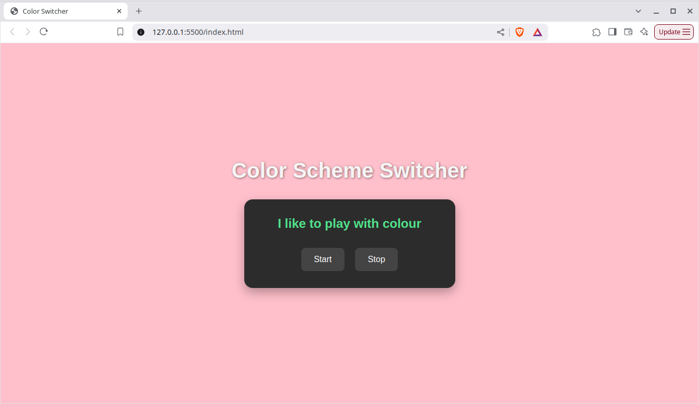

# 🎨 Background Color Changer

This is a simple JavaScript project that dynamically changes the background color of a webpage at regular intervals using an array of predefined colors. It provides Start and Stop buttons to control the color change.

## ✅ Features

- Random background color change on an interval
- Start/Stop button functionality
- Clean and simple UI

## 🧠 How It Works

- When you click the **Start** button, it triggers a function that changes the background color every second using `setInterval`.
- The color is picked randomly from a predefined array of color names.
- When you click the **Stop** button, it stops the color-changing action using `clearInterval`.

## 🖼️ Demo
![Demo Screenshot]

